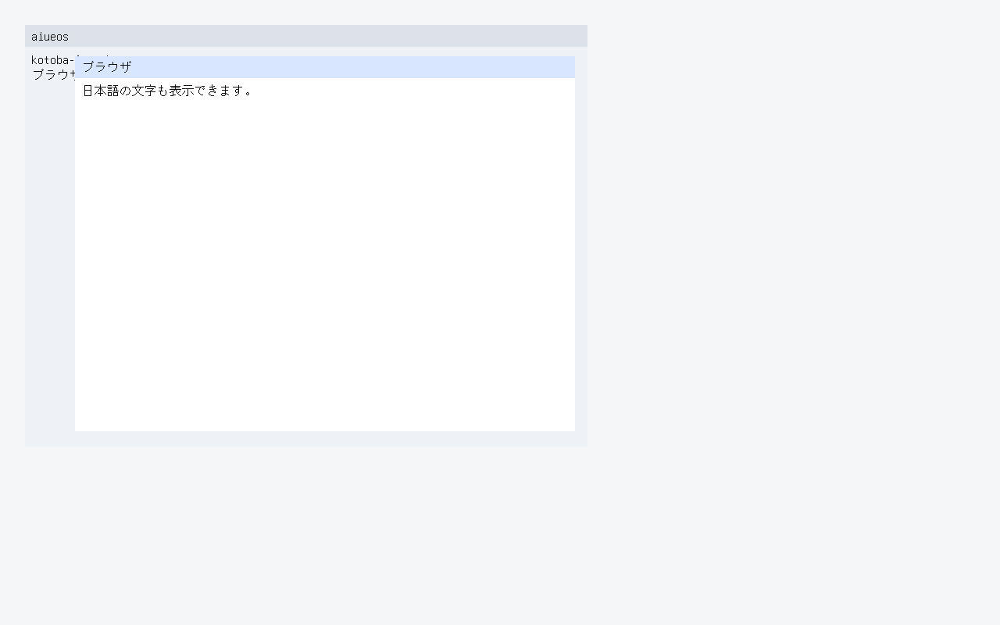
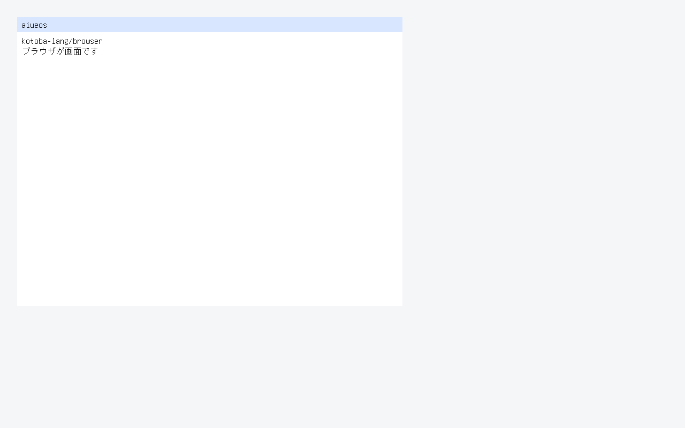

# ADR-0224 — The guest desktop draws text: font in the initramfs, layout in Kotoba

Date: 2026-09-24

## Status

Accepted, extending ADR-0223 (the browser surface is the guest desktop).

- **Text is green only when**
  `kbb --backend sci --classpath src scripts/compositor-guest.cljk guest-browser-text`
  prints `AIUEOS_COMPOSITOR_GUEST_BROWSER_TEXT_OK`: KERNEL.ELF serial has
  `AIUEOS_GUEST_BROWSER_TEXT_OK ops=57 text-px=1084 hash=d2e7456a font-bytes=267208 surface=1280x800`.
- **Text after a raise is green only when** `... guest-browser-text-raised`
  (`AIUEOS_GUEST_BROWSER=1`, a virtio-tablet press) also finds
  `AIUEOS_GUEST_BROWSER_TEXT_RAISED_OK hit=1 ops=57 text-px=864 hash=5cd907f9`.

`text-px` / `hash` are the count and the FNV-1a (raster order, each position
as the four little-endian bytes of `y * 65536 + x`) of every #111111 pixel on
the whole screen. The answers come from a model of the same two frames written
apart from both the Kotoba object and the C blitter (layout rules as in the
object header, rasterised from the committed font). A mirrored glyph, a
shifted line, a back window's text over a front window, or a wrong fallback
moves the hash.

Not executable, and stated here rather than at the end:

- **Not kotoba-lang/browser's text stack.** No cssom flow layout, no word
  breaking, no bidi, no combining marks, no font fallback chain: lines break at
  the glyph that would cross the right inset. Named leftover `:no-flow-layout`.
- **No editing.** Text comes from the surface's title/body words; typing and
  IME into a window are leftover `:no-text-edit`.
- **One bitmap size.** 16 px, 8 px half-width / 16 px full-width. No
  scaling, no anti-aliasing.
- **Not P5.** QEMU ≠ P5.

## Context

ADR-0223 put the browser surface on KERNEL.ELF with `:no-text-raster` as its
first leftover. The kernel had one font: a 5x7 upper-case table in
`framebuffer.c` for the K16 qualification screen. Nothing in the workspace
carried Japanese bitmaps (`repo-search font glyph`: `kotoba-lang/glyph` is an
SDF layout contract with no font data, `org-iso-opentype` stops at metadata and
cmap, `scene2d`'s text is 7-segment). The low kernel window is budgeted to
0x1f4000 and the production node image is within 8 KiB of it, so ~260 KB of
glyphs cannot go into `.rodata`.

## Decision

1. **Font source.** GNU Unifont 17.0.05 `unifont_jp` (Japanese glyph forms),
   whose glyphs are dual licensed SIL OFL 1.1 / GPLv2+ with the font embedding
   exception since 13.0.04; used under the OFL (`os/aiueos/fonts/OFL-1.1.txt`,
   `os/aiueos/fonts/README.md` with source URL and SHA-256). The GNU signature
   could not be checked here (the signing key was not retrievable from the
   keyservers tried); the SHA-256 of the fetched BDF is recorded instead.
2. **Subset and format.** `os/aiueos/scripts/make-font.cljk` (kbb, no Python)
   takes every code point JIS X 0208 can name -- enumerated by decoding each
   EUC-JP row/cell with the host's decoder -- plus printable ASCII, U+3000 and
   U+FFFD: 7,422 glyphs, 267,208 bytes, `aiueos-font/v1` (sorted index with a
   width bit, then 32 bytes per glyph). `--check` recompiles and compares.
3. **Transport.** The font is the fourth initramfs entry
   (`font/aiueos-16.fnt`): the loader already binds the archive to a
   compiled-in SHA-256, and the kernel copies it out into a 320 KiB `.high_bss`
   buffer like the recovery ELF. `AIUEOS_INITRAMFS_OK newc entries=4`.
4. **Layout is Kotoba.** `browser-frame2.kotoba`
   (`kotoba_aiueos_browser_frame2(surface, 8192, font, font-bytes)`) writes one
   list of rects AND glyph ops, window by window in stack order, so z-order is
   list order for text too. It admits the font (magic, version, count, length,
   U+FFFD present), binary-searches each code point, falls back to U+FFFD,
   advances 8/16, breaks title lines never (clip) and body lines at the right
   inset, and stops at the bottom inset. Colours and metrics are
   browser.surface's (`:fg` #111111, `:line-height` 20, body padding 8) and
   browser.input's titlebar 28.
5. **C is mechanism.** `aiueos_desktop_present_ops2` blits the named bitmaps
   in list order and refuses the whole frame on an unknown op, an off-surface
   rect or glyph, or a glyph index the font lacks.
6. kotoba-native row `aiueos-browser-frame2` (arity 4) with its own fuel tier.
7. **On the real display.** Once the kernel has sent virtio-gpu its first
   command (GET_DISPLAY_INFO, in the PCI scan), QEMU's virtio-vga shows
   virtio-gpu scanouts and no longer the GOP framebuffer. So every desktop
   frame so far -- ADR-0223's included -- was drawn into memory the gates
   read back, and was not on screen (screendumps froze on the framebuffer
   boot screen). `aiueos_gpu_present_desktop` makes the GOP framebuffer the
   backing of a full-size 2D resource on scanout 0 and transfers/flushes it
   after each text frame: `AIUEOS_GUEST_BROWSER_SCANOUT_OK resource=7
   scanout=0 source=gop-framebuffer`. In the tablet profile the kernel holds
   each frame for 8,000,000 `pause`s and the QMP injector screendumps it when
   the frame's serial line appears (`guest-browser-text.ppm`,
   `guest-browser-text-raised.ppm` in the gate's out directory).

## Consequences

The guest desktop shows window titles and bodies in Japanese and ASCII on
KERNEL.ELF, and a raise re-lays the text in the new order. Leftovers:
`:no-flow-layout`, `:no-text-edit`, `:no-pointer-capture`,
`:native-compositor-absent`, browser component migration, P5.

## Measurement

**2026-09-24, this Mac, QEMU tcg + OVMF.**

- KIR oracle `browser-frame2-v1`: 18 vectors, 6 whole-op-list assertions,
  reasons -7..-1 all observed, over a five-glyph fixture cut from the font
  (a code point outside it must come out as U+FFFD). Seen red for the named
  reason: body never wraps → `body-wraps-at-the-right-inset`; fallback to
  glyph 0 → memory mismatch on `two-windows-...-fallback`; no bottom cut →
  `body-stops-at-the-bottom-inset`; every glyph 8 px → memory mismatch.
- Fuel bisected in the oracle: the worst vector (four windows asking for 384
  glyphs, refused past 272 ops) traps at 8,192 and passes at 16,384 over the
  fixture; with 7,422 glyphs each lookup is ~10 steps deeper, a bound near
  20,500. Tier 262,144 (~12x).
- `guest-browser-text-raised` (first run): `AIUEOS_COMPOSITOR_GUEST_BROWSER_TEXT_RAISED_OK`,
  serial `AIUEOS_GUEST_BROWSER_TEXT_OK ops=57 text-px=1084 hash=d2e7456a font-bytes=267208 surface=1280x800`
  and `AIUEOS_GUEST_BROWSER_TEXT_RAISED_OK hit=1 ops=57 text-px=864 hash=5cd907f9`,
  both equal to the model. The same boot keeps ADR-0223's frame and input
  lines green and `AIUEOS_INITRAMFS_OK newc entries=4`.
- On the real display (screendump of the console, not memory): the text
  frame has 1,084 #111111, 17,800 #d8e7ff and 635,200 #f5f6f8 pixels; the
  raised frame 864 #111111 -- the same text census the gates took from
  memory. Seen red first: B8G8R8X8 for UEFI format 1 put the focused
  titlebar on screen as #ffe7d8 (17,800 px) and the workspace as #f8f6f5;
  the text census could not see it (#111111 and #ffffff are symmetric), the
  titlebar colour did. Before scanout presentation, periodic screendumps
  showed only firmware, loader and the framebuffer boot screen.
- Default profile (no tablet, synthetic keyboard build),
  `guest-browser-text` -> `AIUEOS_COMPOSITOR_GUEST_BROWSER_TEXT_OK`; every
  other guest line prints as before (input synthetic-smoke leftover, IME, WM,
  broker, session, paint, browser frame, gpu-two green; scanout-two
  one-scanout leftover), plus SCANOUT_OK and TEXT_OK.
- Objects reproduce from amu main 6d780f4 (kotoba-native 6b10700):
  `reproduce-kotoba-objects` match=3 for browser-frame2 / browser-frame /
  browser-reduce; `sync-kernel-object-digests --check` scanned=104 stale=0.
