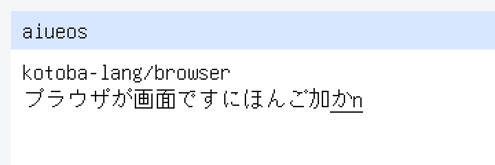

# ADR-0227 — The guest desktop shows the composition, underlined, until it commits

Date: 2026-09-24

## Status

Accepted. Closes the `:preedit` floor of the ADR-0226 ladder.

**Green only when** `kbb --backend sci --classpath src scripts/compositor-guest.cljk guest-browser-preedit`
(`AIUEOS_GUEST_BROWSER=1`) prints `AIUEOS_COMPOSITOR_GUEST_BROWSER_PREEDIT_OK`:
after ADR-0225's typing frame the host types `k a n`, the IME holds か as
preedit and `n` as romaji (nothing committed), and Kotoba frame2 draws both
underlined after window 1's body; then Enter commits かん and the next frame
has no rule. Serial:
`AIUEOS_GUEST_BROWSER_PREEDIT_OK shown-ops=66 shown-px=1130 shown-hash=c9f528cb committed=2 ops=64 text-px=1112 hash=63e3fe67`.

Not: a caret, a highlighted conversion candidate, or composition anywhere but
the end of the focused body (`:no-caret`).

## Decision

1. **Frame2 draws the composition** (`browser-frame2.kotoba`): in the focused
   window only, after the body text, the preedit code points then the romaji
   bytes still in the buffer, each drawn glyph with a 1 px #111111 rule at its
   foot (y + 17), wrapping and cut like the body. It reads the IME words
   (433 romaji length, 434..441, 445 preedit length, 446..477) and refuses
   lengths past their buffers (-8). An empty composition adds nothing, so every
   earlier frame's known answer is unchanged.
2. **The model is a committed script**: `os/aiueos/scripts/browser-frame-model.cljk`
   lays out and paints scenes from the rules in the object's header, apart
   from the object and the C blit, and must reproduce the three frames
   already pinned on KERNEL.ELF (text, text-raised, typed) before its new
   answers (preedit, preedit-committed) are used.
3. **C** types nothing and decides nothing: PREEDIT_GO takes 3 presses through
   `kotoba_aiueos_browser_key`, presents and censuses; PREEDIT_ENTER takes one
   more. The QMP injector sends `k a n` at PREEDIT_GO and Enter at
   PREEDIT_ENTER only after the composition frame has been dumped.

## Measurement

**2026-09-24, this Mac, QEMU tcg + OVMF.** Begun by the first
`cloud.itonami.bot.aiueos-desktop` iteration (08:07Z), which stopped at the
account session limit after 55 turns with the object, contract, model and C
written and nothing landed; finished from that worktree by hand.

- Model: text / text-raised / typed reproduced (d2e7456a / 5cd907f9 /
  7caecfe8); preedit 66 ops 1,130 px c9f528cb; preedit-committed 64 ops
  1,112 px 63e3fe67.
- KIR oracle `browser-frame2-v1`: 28 vectors, 13 memory assertions, reasons
  -8..-1; passes at fuel 32,768 (the object's tier is 262,144). Seen red:
  the rule removed → `composition-ruled-after-the-focused-body`; composition
  in every window → `composition-only-in-the-focused-window`.
- `browser-frame2.o` compiles byte-identical from amu main 10458880 (no
  kotoba-native or amu change: the row and tier are ADR-0224's).
- `guest-browser-preedit` (first run): `AIUEOS_COMPOSITOR_GUEST_BROWSER_PREEDIT_OK`;
  serial `PREEDIT_SHOWN ops=66 text-px=1130 hash=c9f528cb preedit=1 romaji=1`
  and the OK line above. The display screendumps count 1,130 #111111 px with
  the composition and 1,112 after Enter -- the model's numbers on screen.
