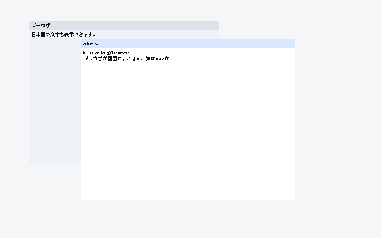

# ADR-0229 — A titlebar drag moves the guest desktop's window

Date: 2026-09-24

## Status

Accepted. Closes the `:drag` floor of the ADR-0226 ladder.

**Green only when** `kbb --backend sci --classpath src scripts/compositor-guest.cljk guest-browser-drag`
(`AIUEOS_GUEST_BROWSER=1`) prints `AIUEOS_COMPOSITOR_GUEST_BROWSER_DRAG_OK`:
after ADR-0228's IME toggle, the host presses the virtio-tablet at (60, 50)
-- window 1's titlebar -- moves to (140, 90), (220, 120), (300, 150),
releases, and moves once more to (380, 200). Window 1 goes from (32, 32) to
(272, 132), the pointer's delta; the move after the release moves nothing.
Serial:
`AIUEOS_GUEST_BROWSER_DRAG_OK events=6 answers=111100 from=32,32 to=272,132 capture=0 ops=67 text-px=1931 hash=6771f3fe`.

Not: a resize (`:no-resize-capture` -- the `:resize` floor), a frame per
move (`:no-redraw-per-move` -- one frame after the gesture; the
`:event-loop` floor), or a window dragged past the surface's origin.

## Decision

1. **The capture is a Kotoba decision** (`browser-reduce.kotoba`), with
   kotoba-lang/browser `browser.input/actions-for-event` as the rule: a
   pointer/down that hits a window inside its titlebar (y .. y + 28,
   inclusive) and outside its 16 px resize handle captures `:drag` with the
   offset from the window origin; a hit anywhere else clears the capture; a
   miss leaves it. pointer/move under a drag is `:window/move` to
   (point - offset) -- `browser.surface/move-window`, which does not focus or
   raise. pointer/up clears the capture. New kinds 3 (move) and 4 (up).
2. **State.** The capture lives in the 128-byte state's spare words: 25 kind
   (0 none, 1 drag), 26 window id, 27 28 offset. Nothing read them before
   (frame / frame2 read words 0..24; the IME starts at 432). A capture that
   is neither none nor a drag of a present window is refused (-4).
3. **One named difference from the oracle.** A move whose origin would be
   below 0 is refused (-6) and changes nothing; browser.surface stores the
   negative origin, the u32 surface cannot.
4. **Expected answers come from the oracle.**
   `os/aiueos/scripts/browser-reduce-oracle.cljk` runs browser.input and
   browser.surface themselves and prints the 21 success vectors of
   `browser-reduce-v1` (seed, answer, whole state after); `--check` compares
   them with the contract. The seven earlier success vectors were
   regenerated the same way: two of their presses land in a titlebar and now
   also capture.
5. **C decides nothing.** The tablet ring stays live after the first press
   (`aiueos_tablet_next`: one event per SYN-closed batch, press / release /
   axes only). DRAG_GO drains it, then C scales each of six events to surface
   pixels, hands it to `kotoba_aiueos_browser_reduce`, compares the answers
   with the vectors' 1 1 1 1 0 0, and reads where window 1 is.

## Measurement

**2026-09-24, this Mac, QEMU tcg + OVMF.**

- KIR oracle `browser-reduce-v1`: 30 vectors, 21 memory assertions, 0 traps,
  observed -6..2. Seen red, each on the vector named for it:
  - the move ignores the offset: `:move-under-a-drag-moves-by-the-delta`;
  - the titlebar foot is exclusive: `:titlebar-foot-is-inclusive`;
  - up keeps the capture: `:up-clears-the-capture`.
- Oracle check: `COMPARED 21`, exit 0; one expected answer changed in a copy
  gives `DIFFERS :the-kernel-drag`, exit 1.
- Fuel: passes at 128, traps at 64 (`:pointer-down-raises-from-the-bottom-of-three`).
  The 1,024 default tier is 8x, so kotoba-native is unchanged.
- `browser-reduce.o` from amu main cfcab304: 1a504334… (6,208 B).
- Model (`browser-frame-model.cljk`): the six pinned scenes reproduced
  (ime-toggle is now pinned); drag 67 ops, 1,931 px, 6771f3fe.
- `guest-browser-drag` (first run): the OK line above, every earlier guest
  browser line unchanged. The screendump `guest-browser-drag.ppm` counts
  1,931 #111111 px. The default no-tablet profile (`guest-browser-text`)
  still prints `TEXT_OK ops=57 text-px=1084 hash=d2e7456a`.
