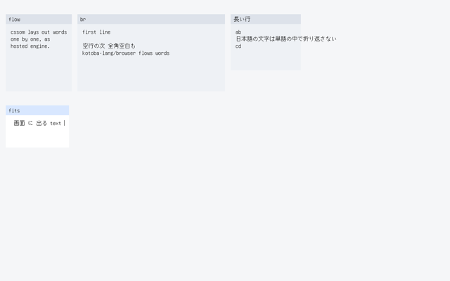

# ADR-0234 — The guest desktop lays out window bodies as cssom does

Date: 2026-09-25

## Status

Accepted. Closes the `:flow-layout` floor of the ADR-0226 ladder, extending
ADR-0224 (text), 0227 (preedit) and 0232 (caret).

**Green only when** `kbb --backend sci --classpath src scripts/compositor-guest.cljk guest-browser-flow-parity`
(default profile, no tablet) prints `AIUEOS_COMPOSITOR_GUEST_BROWSER_FLOW_PARITY_OK`:
KERNEL.ELF lays out a four-window surface of its own with Kotoba
`kotoba_aiueos_browser_frame2`, prints its whole op list
(`AIUEOS_GUEST_BROWSER_FLOW_OPS n=158 words=...`), and every body glyph read out
of it equals, one by one, what kotoba-lang/browser's browser.surface +
cssom.layout draw in the same window's body for the same surface
(`os/aiueos/contracts/browser-flow-parity-v1.edn`, scene `flow`, 135 glyphs);
and the census line is the model's:
`AIUEOS_GUEST_BROWSER_FLOW_OK windows=4 ops=158 text-px=3593 hash=a19f95a8`.

Not, and stated here rather than at the end:

- **No break inside a CJK run** (`:no-cjk-break-opportunity`). cssom packs
  whole words split at white space and has no UAX #14 break opportunities, so
  a Japanese sentence longer than its window overflows it -- in the hosted
  engine and now, identically, on the kernel. A real browser would break
  between ideographs. The fix belongs in cssom; the parity gate would carry it
  here. Visible consequence: ADR-0230's resized window no longer rewraps its
  long Japanese line (its census now equals the drag's).
- **Windows sit at `:window/rect`** (`:windows-sit-at-their-rect`). The hosted
  surface's workspace stacks windows in block flow and draws a 44 px titlebar;
  the kernel keeps the rects browser.input hit-tests and its 28 px titlebar.
  What is compared is the body: glyphs relative to the body box.
- **The kernel clips the body** (`:kernel-clips-the-body`): a glyph whose foot
  passes y + h - 8, or whose right edge passes the viewport, is not drawn. The
  hosted engine paints overflow; the oracle applies the same two clips before
  it writes its answer.
- **The composition and caret are not cssom's.** They are not in the window's
  document; they keep ADR-0227 / 0232's rules from wherever the body ended.
- **Not P5.** QEMU ≠ P5.

## Context

ADR-0224 laid bodies out by the kernel's own rule -- lines broke at the glyph
that would cross the right inset (w - 8), every white-space code point was a
glyph -- and named `:no-flow-layout`. The ladder's goal is kotoba-lang/browser's
surface "laid out as browser lays it out". What browser lays out a window body
with is `browser.surface/window-node` (`[:main {:padding 8} document]`) and
`cssom.layout/draw-ops`, a pure engine with a `:measure-text` hook for a host
that knows its font. Run with this kernel's font as that hook (measured
2026-09-25, local checkouts browser ca3ecab, cssom fd45c4e):

- body text starts 14 in from the body box -- `.window-body` padding 8 plus
  cssom's default-theme `:padding` 6 on the text -- and its lines are exactly
  w - 28 wide (`aaaa bbbbbbb`, 96 px, is one line at w = 124 and two at 123);
- a lone text child whose white-space-collapsed text fits is ONE line as
  collapsed, a leading or trailing space kept (` lead`, `a b `); otherwise it is
  packed by words: the first word of a line whatever its width, each next word
  after one space while the line fits;
- white space is a JS `\s`: U+3000, U+00A0, CR, FF, VT and TAB all collapse to
  one U+0020; a body of nothing but white space draws nothing;
- with ` `s each segment is packed by words (trimmed even when it fits), and
  an empty segment still takes a line;
- a word wider than the line, a kana/kanji run included, overflows it.

## Decision

1. **The kernel's body is the hosted document.** The body code points up to
   the first 0 or the 64th are the window's document text, and each 10 is a
   ` ` -- the kernel's line break was already that.
2. **The rule is written into `browser-frame2.kotoba`** (header BODY FLOW):
   text from (x + 14, y + 42), W = w - 28, 20 px lines; the white-space set
   above; no 10 -- nothing for white space only, one collapsed line if at most
   max(0, W) wide, else packed; with 10 -- every segment packed, each 10 a new
   line. Titles, launcher labels and the composition keep `lay` (glyph-wise,
   clipped or wrapped at their limit); the composition now wraps at x + w - 14
   from the body's line left. Scratch word 430 holds the window width.
3. **Three places, one hub.** `os/aiueos/scripts/browser-flow-oracle.cljk`
   renders every scene through browser.surface + cssom (the committed font's
   advances as `:measure-text`) and writes each window's body glyphs as
   [dx dy glyph width] from the body box into `browser-flow-parity-v1.edn`;
   `--check` recomputes them from the hosted engine. The model
   (`browser-frame-model.cljk --parity`) and the kernel (the gate) are each
   compared with that file, glyph by glyph, by the same span rule: window k's
   ops run from its body rect followed by its titlebar rect to the next
   window's; its body glyphs are the glyph ops there at or below y + 28. The
   KIR contract then ties the object to the model.
4. **Every earlier frame moves.** The inset change moves every text frame the
   desktop gates pin; op counts do not change. Re-pinned from the model, whose
   scenes first matched the hosted engine on all 68 bodies: text 58/1079/89910f34,
   raised 58/880/b9f96599, typed 63/1068/a92b8f58, preedit shown 67/1146/566a1c8f
   committed 65/1128/193030b3, IME toggle 68/1205/322e206e, drag and resize
   68/1947/523440e0, loop chain b185dff1 (last 70/901/7b0f9b05), caret chain
   62295970 (caret x 458 466 450 434 418 on y 214; last 68/867/d039564f),
   launch chain 2845aee9 (last 85/776/98b595bd).
5. **The flow-parity frame** runs after the tablet chain (right after the text
   frame in the default profile) on a surface buffer of its own: window 1 packs
   by words with two spaces, a tab and U+3000 collapsed, its first line exactly
   W and its second a word past it; window 2 has ` ` segments with leading
   and trailing spaces and an empty one; window 3 has a kanji/kana run that
   overflows it; window 4's collapsed body is exactly W and keeps its leading
   and trailing space.

## Consequences

The desktop's window bodies are laid out by the hosted engine's rules, checked
against the hosted engine itself rather than against a restatement of it.
Leftovers: `:no-cjk-break-opportunity` (upstream cssom), `:windows-sit-at-their-rect`,
`:kernel-clips-the-body`, browser component migration, P5.

## Measurement

**2026-09-25, this Mac, QEMU tcg + OVMF.**

- Hosted engine vs model: `browser-frame-model.cljk --parity` COMPARED 68
  bodies, 0 differences, first run. Seen red for the named reason (model
  broken on purpose, each restored): W = w - 16 → `flow window 1 glyph 34`
  (only once the scene had a line exactly W and one a word past it -- the first
  scene did not tell w - 16 from w - 28, and was redesigned); W = w - 29 →
  `flow window 1 glyph 14`; a fitting body not kept as collapsed → 35 bodies;
  text inset 8 → all 68; empty ` ` segments dropped → `flow window 2 glyph 10`.
  A tampered file glyph is caught by both `--check` (exit 1) and `--parity`.
- KIR oracle `browser-frame2-v1`: 43 vectors, 27 whole-op-list assertions,
  reasons -9..-1 all observed. The 19 older lists were regenerated by the
  model's new `--vectors` decoder, which with the old body rule put back first
  reproduced all 19 byte for byte. Eight new vectors over a six-glyph fixture
  (U+0020 added). Seen red on the vector that names the rule: W = w - 16 →
  `body-a-line-one-pixel-past-w-breaks`; the leading space dropped →
  `body-that-fits-keeps-its-leading-and-trailing-space`; no viewport clip →
  `a-glyph-past-the-viewport-is-not-drawn`; a code point skipped after each word
  → `two-windows-titles-bodies-newline-and-fallback`.
- Fuel bisected in the oracle over the fixtures: passes at 22,444, traps at
  21,424 (`full-composition-past-261-ops-is-refused`). The kotoba-native tier
  stays 262,144; no kotoba-native row or amu pin change.
- `guest-browser-flow-parity` (default profile, first run):
  `AIUEOS_COMPOSITOR_COMPARED 135`, `AIUEOS_GUEST_BROWSER_FLOW_OK windows=4 ops=158 text-px=3593 hash=a19f95a8`,
  `AIUEOS_GUEST_BROWSER_TEXT_OK ops=58 text-px=1079 hash=89910f34`, FRAME_OK
  ops=5 unchanged.
- Tablet profile (`guest-browser-launch`, first run): every re-pinned line
  above appeared on KERNEL.ELF serial exactly (TEXT, TEXT_RAISED, TYPE,
  PREEDIT, IME_TOGGLE, DRAG, RESIZE, LOOP idle-min=87, CARET caret=418,214,
  LAUNCH), then FLOW_OK; all thirteen browser desktop classifiers exit 0 on that
  one serial, flow-parity with COMPARED 135. The 31 screendumps count the same
  #111111 pixels as memory, frame for frame (text 1,079 ... flow 3,593).
- Provenance: `browser-frame2.o` recompiled and attested with amu 219cb959
  (16,128 bytes); `--emit-provenance` objects=115; digests stale=0 after
  `--write`. Classifier tests 15 / 213.
