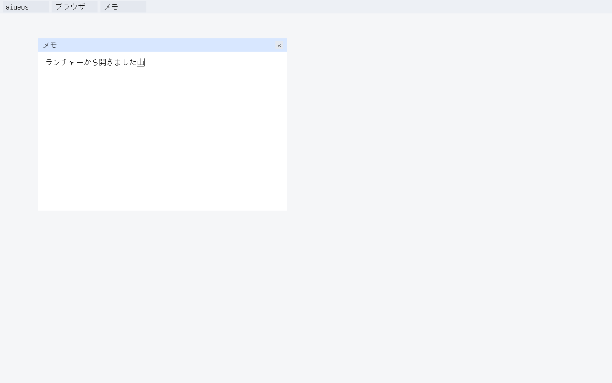

# ADR-0235 — The guest desktop IME converts through a dictionary generated from Unihan

Date: 2026-09-25

## Status

Accepted. Closes the `:dictionary` floor of the ADR-0226 ladder, extending
ADR-0225 (typing) and ADR-0088 (hosted Space conversion).

**Green only when** `kbb --backend sci --classpath src scripts/compositor-guest.cljk guest-browser-dictionary`
(tablet profile, after the launcher) prints
`AIUEOS_COMPOSITOR_GUEST_BROWSER_DICTIONARY_OK`: KERNEL.ELF booted with
`ime/aiueos-kanji.dic` in its initramfs
(`AIUEOS_GUEST_BROWSER_DICT_GO keys=5 dictionary-bytes=189892`); the host typed
`y a m a Space` and Kotoba `kotoba_aiueos_browser_key` found やま by binary
search, converted it on record 44512 to its first candidate 山 and drew it as
the composition
(`AIUEOS_GUEST_BROWSER_DICT_SHOWN keys=5 converting=1 record=44512 preedit=1 cp=23665 ops=87 text-px=834 hash=e85b42b2`);
then `Space Escape Space Enter s h o u Space Space Enter` cycled to 岾, put the
reading back from its record, converted again, committed 山, and committed 償
(しょう's second candidate) into window 3's body:
`AIUEOS_GUEST_BROWSER_DICT_OK keys=16 answers=0000000010000001 record=44512 committed=23665,20767 shown-ops=87 shown-px=834 shown-hash=e85b42b2 ops=87 text-px=915 hash=eaa427b3`.
The answers are browser-ime-v2's; both censuses are
`os/aiueos/scripts/browser-frame-model.cljk`'s.

Not, and stated here rather than at the end:

- **One kanji per candidate** (`:single-kanji-candidates`). Unihan gives each
  kanji its readings; it has no words. 日本 cannot be typed as にほん -- にほん
  is in no record, and Space commits the kana.
- **Okurigana are not marked** (`:okurigana-unmarked`). A kun reading is a
  whole word (くわえる) and converts to the kanji alone (加), because Unihan
  does not say where the stem ends. KANJIDIC marks it, under a different
  license; it was not taken.
- **No learning, no frequency** (`:no-learning`). The order is a rule, the
  same on every boot.

## Context

ADR-0225's oracle knew three readings (か 加可課, ひ 日火, あ 亜): conversion was
a demonstration. SKK's dictionaries are GPL. The owner decided on 2026-09-25
to generate the dictionary in-repo from Unicode's Unihan database (Unicode
License v3), for every kanji the desktop font carries, and to carry it in the
initramfs like the font, with the hosted oracle reading the same file.

## Decision

1. **The generator** `os/aiueos/scripts/gen-ime-dictionary.cljk` reads
   Unihan 17.0.0 (`Unihan.zip`, SHA-256 recorded in `os/aiueos/ime/README.md`)
   and the font, and writes `os/aiueos/ime/aiueos-kanji.dic` (`--check`: exit
   0 identical, 1 differs, 2 could not run). It reads `kJapanese` -- the
   readings in kana, in Unihan's order -- rather than `kJapaneseOn` /
   `kJapaneseKun`, which carry the same readings in romaji and fewer of them
   (U+4E0B: 14 against 5); kana needs no romanisation undone. The floor's
   goal named the romaji fields; this is recorded in the ladder. Katakana
   folds to hiragana; 9 readings that are not hiragana after the fold are
   left out. 6,355 kanji, 6,344 with readings, 3,871 readings, 23,679 pairs,
   189,892 bytes.
2. **The candidate order is a rule in the generator**: Jouyou
   (`kJoyoKanji`), then Jinmeiyou (`kJinmeiyoKanji`), then the rest of JIS
   level 1, then level 2; then the reading's position in the kanji's own
   `kJapanese` list; then code point. JIS row/cell was tried as the last key
   and rejected: level 1 is ordered by each kanji's representative reading,
   so か put 渦 (うず) first.
3. **Format `aiueos-dict/v1`**: u32 words, a header (magic "AIUD", version,
   reading count N, word count W), N record offsets sorted by reading, then
   records `L reading C candidates`. The object binary-searches it.
4. **The object** `browser-ime.kotoba` takes
   `[surface surface-bytes dictionary dictionary-bytes key]`. Five parameters
   is the native ceiling and the dictionary took two, so the key code and its
   value share one: key = code × 4 + value. The whole preedit is the reading
   (any length up to the preedit's 32 code points). While it is converted,
   word 444 holds the record's word offset (it held the one-code-point
   reading), so Escape and Backspace put the reading back from the
   dictionary. The dictionary's bytes are written to word 479 on every call
   and bound every read of it, as frame2 keeps the font's. A dictionary that
   is there must pass its header check before any key is taken (-6); a record
   out of bounds refuses the conversion (-6); no dictionary (null or 0 bytes)
   converts nothing and Space commits kana.
5. **The oracle** `aiueos.compositor.ime` reads the same file
   (`os/aiueos/ime/aiueos-kanji.dic`, JVM and ClojureScript). か's first
   candidate is now 下, so the hosted kanji admission (ADR-0088), its test and
   `desktop/kanji-admitted?` say 下.
6. **C** copies `ime/aiueos-kanji.dic` out of the initramfs (256 KiB bound)
   and hands it to every `kotoba_aiueos_browser_key` call. It never looks a
   reading up.
7. **The type gate keeps its census.** ADR-0225's `k a Space` would now
   commit 下 and move every census pinned after it. The host types
   `k u w a w a r u Space` instead: くわわる's one candidate is 加, the kanji
   that gate has always committed (19 presses, committed 5, the same
   `ops=63 text-px=1068 hash=a92b8f58`).
8. **Fuel.** The contract bisected the dearest step (Space on a reading the
   search does not find, twelve probes) at trap 600 / pass 640; a
   ten-code-point reading with shared-prefix neighbours bounds it near
   1,300. kotoba-native fe3409bf gives `aiueos-browser-key` its own tier,
   16,384 (~12×), and the arity-5 row; amu pins it.

## Evidence

- `os/aiueos/contracts/browser-ime-v2.edn`: 55 vectors / 205 steps / 162
  memory assertions, every one against the committed dictionary (sha256- and
  length-pinned in the contract), 0 traps. Broken twice: the record compare's
  sign flipped fails `:ka-space-converts-to-the-first-candidate` (Space
  answered 1: nothing found, the kana committed); the reading put back from
  the record's first word instead of its second fails
  `:escape-cancels-back-to-the-reading` (body memory).
- `gen-ime-dictionary.cljk --check`: exit 0 on the committed file, 1 with one
  byte changed, 2 with no Unihan directory.
- The type gate, run again with the new object and keys, prints the same
  census it pinned in ADR-0225; every gate after it (preedit, toggle, drag,
  resize, loop, caret, launch) prints its own OK line in the same boot.

## Consequences

- The desktop can type any kanji of JIS X 0208 by one of its Unihan readings.
- Words, okurigana and learning are the next dictionary's work; the format
  has room (a candidate list of any length of code points per record would be
  v2).
- A regenerated dictionary moves record offsets: the gate pins record 44512
  and the contract pins the file's sha256, so either change is seen.

## Measurement on KERNEL.ELF

**2026-09-25, this Mac, QEMU tcg + OVMF.** The loop iteration that wrote this
floor (22:35Z, killed by the loop's 3-hour timeout while its amu pin PR was
being redone for the third time) left the serial lines above as the model's
predictions: its image never reached the desktop. The kernel still admitted
exactly 4 initramfs entries, so adding `ime/aiueos-kanji.dic` as the fifth
stopped every boot at `AIUEOS_INITRAMFS_FAIL newc-structure` (QEMU exit 209).
Finished by hand from its worktree: the count, both `entries=` markers and the
smoke's grep now say 5.

- `guest-browser-dictionary`: `AIUEOS_COMPOSITOR_GUEST_BROWSER_DICTIONARY_OK`;
  serial `AIUEOS_INITRAMFS_OK newc entries=5 ...`,
  `AIUEOS_GUEST_BROWSER_DICT_SHOWN keys=5 converting=1 record=44512 preedit=1 cp=23665 ops=87 text-px=834 hash=e85b42b2`,
  `AIUEOS_GUEST_BROWSER_DICT_OK keys=16 answers=0000000010000001 record=44512 committed=23665,20767 ... ops=87 text-px=915 hash=eaa427b3`
  -- equal to the model's lines above. Every earlier desktop line in the same
  boot (loop, caret, launch, flow) is green.
- Display screendumps: 834 and 915 #111111 px, = memory.

