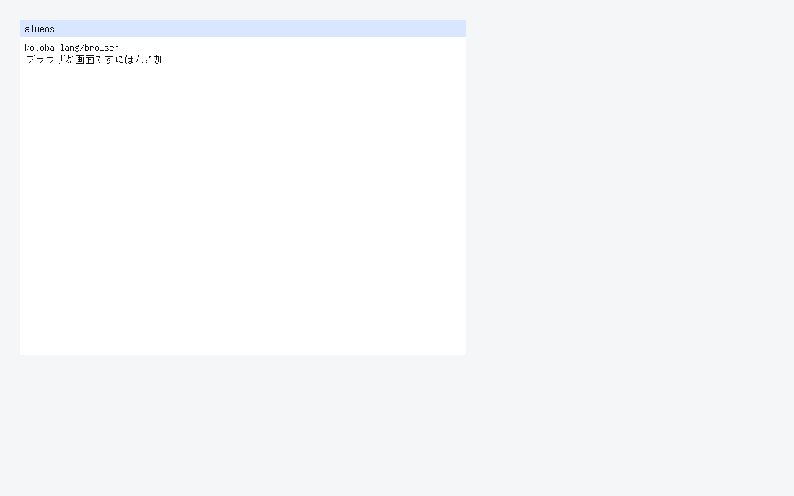
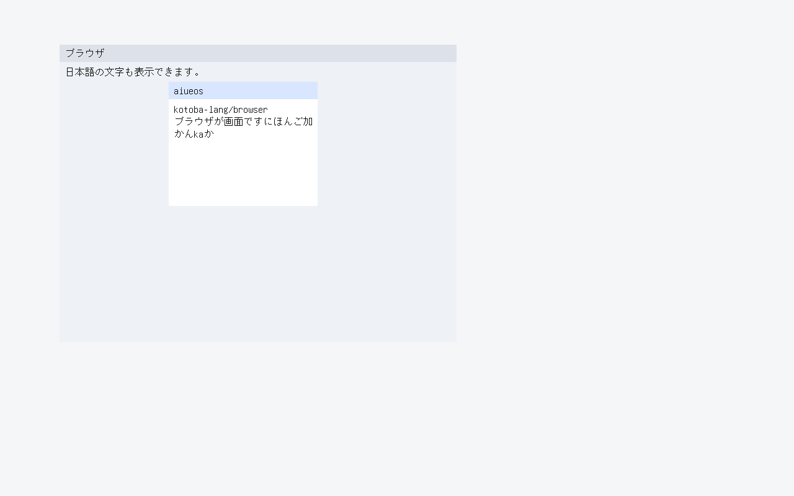
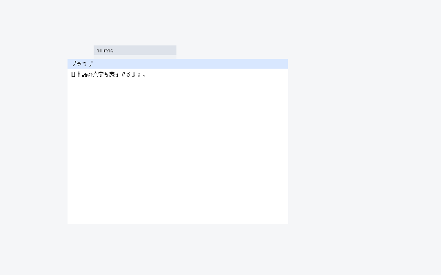
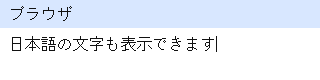
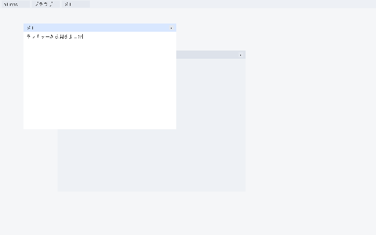

<p align="center">
  
</p>

# aiueos

**An operating system.** Same category as Linux, Windows and macOS: it owns
firmware handoff, page tables, interrupts, scheduling, address spaces,
syscalls and device drivers, and it boots on real hardware architecture from
a signed image it builds itself. It is written in Kotoba, and the code that
makes decisions is compiled from Kotoba source rather than hand-written in C.

**It does not decide who may do what.** That moved to
[`kotoba-lang/grant`](https://github.com/kotoba-lang/grant) on 2026-08-21
(root ADR-2608219500). Aiueos asks; grant answers; aiueos enforces the answer.
Before that split this repository named an authority and a machine at once,
and the two were nearly the same size.

## Where it actually is

An operating system is a claim with a lot of surface, so here is the measured
state rather than the ambition. The production profile is **C-free bare
metal**: the loader and kernel are compiler-emitted, and an effect counts as
native only when its artifact receipt has empty `c_sources`,
`foreign_objects`, `imports` and `dynamic_dependencies` (ADR-0013).

| | Status |
|---|---|
| Firmware to ring-0 Kotoba | **working** — compiler-emitted PE32+ `BOOTX64.EFI` and ELF64 `KERNEL.ELF`, bounded segment admission, final UEFI memory map, `ExitBootServices`, CR3 and port-I/O evidence |
| CPU and memory | **partial** — a bounded six-page C-free slice: Kotoba-derived physical allocator, a 512-entry first-GiB identity map loaded into CR3, W^X and guard pages, a Kotoba-built vector-14 IDT and real CPU fault receipts (ADR-0039/0040). A general allocator, dynamic mapping, ACPI, APIC, IRQ dispatch and SMP are not C-free yet |
| Kernel execution | **not yet** — context switch, preemptive scheduler, ring 3, syscall entry/exit, capability handle table all still reference-profile only |
| Hardware | **not yet** — PCI, DMA, IOMMU, MSI-X, virtio, NVMe, USB HID are reference C with QEMU evidence, not compiler-emitted |
| Boot and release | **working** — deterministic GPT disk and El Torito ISO from one builder, byte-identical recovery ESP with proven firmware fallback, update and rollback receipts, RSA-2048 release-signature verification, durable crash receipts, initramfs, Multiboot2/GRUB |
| Desktop | **partial** — the browser surface is the guest desktop on KERNEL.ELF: Kotoba writes kotoba-lang/browser's retained draw list and reduces a real virtio-tablet press to focus-and-raise (`guest-browser-frame` / `guest-browser-input`, ADR-0223), and draws window titles and bodies in Japanese and ASCII from a Unifont subset carried in the initramfs (`guest-browser-text` / `guest-browser-text-raised`, ADR-0224), and takes typing: a real virtio-keyboard through a Kotoba IME that mirrors the hosted `aiueos.compositor.ime` into the focused window (`guest-browser-type`, ADR-0225). hosted WM (ADR-0085) stacks two `window-session-state` surfaces in the same DADS `#desktop`; raise changes z-order; `kbb -M:compositor wm`. Guest 2D create/flush is `kbb -M:compositor gpu` (ADR-0084). hosted IME romaji→kana is `kbb -M:compositor ime` (ADR-0086). hosted kanji (Space converts か→加) is `kbb -M:compositor kanji` (ADR-0088). hosted kami.webgpu presenter (`init!`/`draw!` on `#kami-viewport`) is `kbb -M:compositor kami` (ADR-0089). Guest IME is KERNEL.ELF Kotoba `k`+`a`→U+304B (`kbb --backend sci --classpath src scripts/compositor-guest.cljk guest-ime`, ADR-0090). Guest WM is KERNEL.ELF Kotoba z-hit of two overlapping boot rects (`kbb --backend sci --classpath src scripts/compositor-guest.cljk guest-wm`, ADR-0091). Guest paint is KERNEL.ELF filling those rects in z-order (`kbb --backend sci --classpath src scripts/compositor-guest.cljk guest-paint`, ADR-0092). Guest input is KERNEL.ELF consuming a virtio-keyboard used-ring event (`kbb --backend sci --classpath src scripts/compositor-guest.cljk guest-input`, ADR-0093). Guest gpu-two is KERNEL.ELF creating two virtio-gpu 2D resources when Kotoba admits n=2 (`kbb --backend sci --classpath src scripts/compositor-guest.cljk guest-gpu-two`, ADR-0094). Guest scanout-two is KERNEL.ELF binding scanout 1 to resource 2 (`kbb --backend sci --classpath src scripts/compositor-guest.cljk guest-scanout-two`, ADR-0095). Guest broker is KERNEL.ELF Kotoba clipboard admit / picker refuse (`kbb --backend sci --classpath src scripts/compositor-guest.cljk guest-broker`, ADR-0096). Guest session restore is KERNEL.ELF Kotoba packed front 2 (`kbb --backend sci --classpath src scripts/compositor-guest.cljk guest-session`, ADR-0098). Leftover `:native-compositor-absent` (native component runtime, P5). **P5 UNVERIFIED**. Not a finished Chrome OS-shaped desktop |
| Content addressing | **partial** — `cid-v1-admit` decides that a block is the content a binary CIDv1 names, reading version, codec, multihash and digest length rather than taking a caller's 32 bytes on trust; `unixfs-file-admit` decides a canonical UnixFS file root, so an artifact larger than the 12,288-byte SHA-256 bound is verified block by block against one name (ADR-0128). Both are checked by verifiers that EXECUTE them against their contracts — the first here that do, since kotoba-kir gained an optional memory image. **Neither is linked into `KERNEL.ELF` yet** (amu's kotoba-native pin), so no boot has run either, and the OTA and model-channel paths still verify by manifest digest |
| Bare-metal net (P2) | **green on QEMU UEFI** — guest TLS 1.3 + HTTPS GET of empty raw CID with SHA-256 admit (ADR-0082). CertificateVerify ECDSA P-256 is `kbb -M:bare-metal cert-verify` (ADR-0087). Hosted `cloud-live` / session smoke / host curl do not count. Chain-to-anchor still leftover |

**Every gate above except P5's claim is QEMU/OVMF.** P5 real-machine boot is
**UNVERIFIED** (ADR-0084): this Mac is the QEMU host; attached USB is an
Ubuntu installer + data volume, not an aiueos image; USB OVMF is forbidden
as P5 (root ADR-2608221625 / ADR-0019). QEMU ≠ P5. Parity with Linux,
Windows or macOS is not claimed.

## What it is not

- **Not a desktop, not a phone, not an embedded target.** The only ISA with a
  complete bare-metal kernel is x86-64. The AArch64 material under
  `os/aiueos/aarch64/` is a bare-metal **bootstrap** (UEFI loader + freestanding
  kernel with a self-built `TTBR0_EL1` and enforced W^X, ADR-2608080600 tracks
  a1/a2) — it does not yet reach a userspace or full kernel, so it is not a
  second port. The AArch64 artifacts under `resources/hvt/` are
  hypervisor-guest spikes. There is no Android, iOS,
  Raspberry Pi or IoT profile, and nothing here claims one.
- **Not POSIX.** The first syscall ABI is capability-handle based. POSIX is an
  optional service, not the kernel authority (ADR-0013).
- **Not the authority.** `grant` decides admission, policy, signing, surfaces
  and profiles. What is here is the machine that carries out the decision --
  and the last place that could ignore it, which is why so much of it is still
  in the TCB inventory.

## The C boundary, stated as it is

`os/aiueos/kernel/` carries about 7,000 lines of C and assembly. That is not a
crt0 shim; it is a real mechanism kernel, and ADR-0015 says so rather than
repeating the older "minimal entry shim" story.

The reviewable property is **decision-free C**: C and assembly own registers,
MMIO, GDT/IDT, paging primitives, APIC/SMP bring-up, virtqueue plumbing and
context switch. Every *decision* -- SHA-256 and RSA-2048 verification,
ELF/catalog/journal admission, capability encode/admit/derive/revoke planning,
scheduler dispatch planning, pointer/length window admission, syscall-range
validation -- is compiler-emitted Kotoba. The C substrate contains no digest,
signature, admission or capability logic.

That reference kernel is an oracle and a porting specification. It is **not**
cumulative evidence that the C-free kernel implements the same mechanism;
only the C-free ledger in ADR-0013 is.

## Runtime dependencies

No Rust: the runtime crate and `bin/aiueos.rs` were retired and reimplemented
in CLJC, and `safe.rs` was dropped as redundant. There are zero `.rs` files
here.

No JVM **in what boots**: the C-free rule forbids libc, a CRT, a JVM, Linux
and any hosted supervisor in the bare-metal profile, and the artifact receipt
is what enforces it.

A JVM **in the hosted profiles and in the toolchain**: `aiueos.execute` hosts
compiled Kotoba Wasm through Chicory and is JVM-only, as is
`aiueos.launcher`. Fuel metering rides Chicory's `withUnsafeExecutionListener`
-- documented unsafe, experimental, interpreter-path-only -- so treat it as a
working prototype on an unofficial API rather than a guarantee. Memory limits
use a stable API.

## Position in the stack

```text
kotoba semantics -> amu -> kotoba-native freestanding ABI -> aiueos boot images
                                                     grant -> aiueos (decides)
                                                     aiueos -> kototama (executes)
```

`kototama` executes Components and `murakumo` places them in a fleet. Aiueos
supplies the named providers and the machine underneath them; it does not own
another system's compiler or fleet scheduler, and since the split it does not
own the grant vocabulary either.

## Native dependency and evidence boundary

The production dependency is deliberately one-way:

```text
Kotoba semantics
  -> kotoba-native instruction selection and freestanding ABI
  -> Amu compiler/package emission and qualification
  -> aiueos loader, kernel, effects, and machine evidence
```

`kotoba-native` does not own an OS provider, Amu does not own process or
hardware isolation, and aiueos does not redefine language or instruction
semantics. An effect is production-native only when the same exact-pinned
chain reaches the compiler-emitted `BOOTX64.EFI` and `KERNEL.ELF`, carries an
empty foreign-code receipt, and passes positive plus fail-closed QEMU evidence.
Hosted `aiueos.vm`, experimental `aiueos.hvt`, and the older C/assembly kernel
are useful oracles, but none qualify the C-free bare-metal profile.

The ownership decision and gap ledger are
[`ADR-0013`](90-docs/adr/0013-native-os-ownership-and-boot.md); the current
C-free W^X/guard and CPU-fault evidence is
[`ADR-0039`](90-docs/adr/0039-c-free-page-fault-hardware-receipts.md), with
bounded recovery in
[`ADR-0040`](90-docs/adr/0040-c-free-recoverable-page-fault-frame.md). Amu
records the consumer/compiler boundary in ADR-0240; the root handoff is
ADR-2608110400.

## Reference stack topology and C mechanism boundary

aiueos is the stack's **capability broker**: dependency-minimal by invariant
(deps.edn carries `security` + Chicory only; enforcement layers like
`kototama` import aiueos, never the reverse), consuming the Kotoba compiler
as **verified artifacts** (freestanding ELF objects), not as a library. The
historical bare-metal split — C/asm owns mechanism only, every decision (crypto
verification, admission, capability planning, dispatch planning) is
compiler-emitted Kotoba — is stated honestly, with measured line counts, in
[`90-docs/adr/0015-stack-topology-and-honest-c-boundary.md`](90-docs/adr/0015-stack-topology-and-honest-c-boundary.md)
(root authority: `com-junkawasaki/root` ADR-2607241100).

## What is here

The decision namespaces that used to be listed under this heading moved to
[`kotoba-lang/grant`](https://github.com/kotoba-lang/grant) on 2026-08-21 --
`contract`, `graph`, `policy`, `authority`, `surface`, `manifest`, `signing`,
`audit`, `broker`, `cli`, `decide` and fourteen more. They are reached here as
`grant.*` and pinned by git SHA in `deps.edn`; grant's README is where they are
documented now.

`aiueos.topic` stayed: the in-process pub/sub bus is a substrate, not a
decision. Which topics a component may publish to is decided in
`grant.manifest`; carrying the messages is this repository's job.

### Kotoba guests (ADR-0202)

Three namespaces now compile as pure Kotoba guests, the `.cljc` staying as
the parity oracle (ADR-0202): `aiueos/topic.kotoba` (the whole topic bus —
publish / latest / take-sample / pending / topic-count / tick / advance),
`aiueos/os_update.kotoba` (health-status, boot-selection, the non-regex
manifest faults) and `aiueos/model_channel.kotoba` (the four
sequence-history rules and the boot decision). All three compile
(`amu compile --target wasm32-browser`), none declares or calls a
capability: effect inference answers `:effects #{}` for a guest that only
moves immutable documents, and the pure-product profile would reject a
capabilities declaration outright. Measured bounds are stated in each
guest's header — `:container-items 32` (a 33rd queued sample traps
`document-vector-too-large`, fail-closed), `max-parameters 5` (booleans
travel as an i64 flags vector), no `rem`/`mod` lowering (spelled
`quot`-and-subtract). Regexes over wire bytes, publisher closures and the
clock stay in the host. The rule the ADR records: a pure guest is written
with zero capability lines; a guest that touches the world declares
exactly the capabilities it uses, through `perform`, and nothing else.

What is left here executes, boots and drives hardware.


- `src/aiueos/execute.cljk` **actually executes** a compiled `.kotoba` Wasm
  component (ADR-2607022900), via [Chicory](https://github.com/dylibso/chicory).
  Verifies through `grant.broker/verify-one` first and refuses to run anything
  denied; the 7 non-hardware kernel capabilities (`log-write`/`clock-monotonic`/
  `random-bytes`/`topic-*`) get real Clojure-backed host functions, the
  device-access quartet (`pci-config`/`dma-map`/`irq-subscribe`/`mmio-map`) stays
  a deterministic stub pending real hardware access (native shim or
  `java.lang.foreign`, unresolved). Enforces `:aiueos/quota {:host-calls N
  :publishes N}` (ADR-0006) — a per-run host-function call-count cap; exceeding
  it aborts the run mid-execution (`:aiueos.execute/quota-exceeded`, offending
  call's own effect never lands). Also enforces `:aiueos/limits :fuel`
  (ADR-0001) — **real instruction-level metering**, via Chicory's
  `Instance.Builder/withUnsafeExecutionListener` (fires per Wasm instruction
  executed). Chicory has no first-class gas-metering API, and this hook is
  explicitly documented `unsafe`/`experimental`/possibly removed later (its
  supported execution-limit mechanism is a wall-clock thread-interrupt timeout,
  not this) — treat fuel enforcement as a working prototype on an unofficial
  API, not a permanent guarantee. It also only fires in Chicory's interpreter
  path; a future switch to Chicory's AOT compiler would bypass it entirely.
  Also enforces `:aiueos/limits :memory-pages` (ADR-0001) — via a **stable**
  Chicory API (`Instance.Builder/withMemoryLimits`, not marked
  unsafe/experimental like the fuel listener). Reads the module's own declared
  initial page count (never overridden) and caps only the maximum
  `memory.grow` can reach; unlike quota/fuel/topic-forbidden, this does NOT
  abort the run — `memory.grow` past the cap returns Wasm's own `-1` failure
  sentinel to the guest. Also enforces `:aiueos/publishes`/`:aiueos/subscribes`
  (the topic-id allow-set `grant.manifest/normalize` derives) — a granted
  component's `topic_publish`/`topic_poll`/`topic_take`/`topic_count` calls are
  restricted to its declared topic ids (`nil` = unrestricted). Every result
  also carries an ADDITIVE `:aiueos/run-receipt` (`grant.broker/run-receipt`,
  ADR-2607022900 follow-up 8): `:succeeded`/`:failed`/`:denied` status,
  `:started-at`/`:finished-at` (epoch ms), and the same audit events.
  **JVM-only** — needs `kbb -M:test` (Chicory was never in babashka's class
  allowlist, and babashka has since been retired outright).
- `src/aiueos/launcher.cljk` is a real, runnable CLI: the retired Rust
  `bin/aiueos.rs`'s argv-parsing/file-I/O role, reimplemented as JVM Clojure.
  Ties `grant.cli` + `grant.manifest` + `grant.policy`/`grant.broker` +
  `aiueos.execute`/`aiueos.audit` together. `verify`/`run`/`admit`/`inspect`/
  `surface`/`audit`/`up` are wired today (`run`/`admit` actually execute a
  granted component's declared `:aiueos/wasm`, not just decide; `up` boots the
  components due at a given ADR-0006 cycle (`--cycle N`, default 0) in
  `grant.graph/priority-boot-order`, stopping at the first
  denied/quota-or-fuel-exceeded DUE component). Try it: `kbb -M -m
  aiueos.launcher up <system>.edn --cycle 3 --edn`. **`:aiueos/schedule`'s
  `:deadline-cycles` is NOT enforced** — see `grant.manifest/due-this-cycle?`'s
  docstring for why. **JVM-only**, same reason as `aiueos.execute`. Not wired:
  four adapter-only commands (`sign`/`check`/`compile`/`hash`). `image` and
  `vm` are wired for the experimental Linux-hosted PID-1 profile (ADR-0011).
- The contract EDN under `resources/aiueos/` moved to grant with the code that
  reads it. The keys did not change: `:aiueos.policy/*`, `:aiueos.broker/*` and
  `:aiueos/*` are on the wire, read by `kototama`'s adapter and by stored
  decisions, so only the namespaces were renamed. They still load from the
  same classpath paths, now shipped by the grant dependency.
- `test/aiueos/*_test.cljc` checks every CLJC validator/reasoner/contract above.

The one exception worth naming on the language side: the retired `safe.rs`
(safe-kotoba subset gate) was NOT ported because it's redundant — that check
already lives in `kotoba-lang/kotoba`'s `kototama`/`kotoba-clj` layer.

## Examples / deployment docs

- `examples/**/*.edn` and `examples/**/*.clj` — runnable manifests/policies
  across the robot, browser, computer-use, driver, and signed-component
  surfaces.
- `docs/deployment-profiles.md`, `docs/incident-exercises/`, `docs/issues/` —
  deployment-profile-specific security claims and IR drill writeups.
- `90-docs/adr/` — architecture decisions for the capability OS and its
  surfaces.

## Verify

```bash
kbb -M:test   # full suite, including aiueos.execute-test (Chicory, JVM-only)
./os/aiueos/scripts/smoke-qemu-journal-recovery.sh # no-Linux OVMF gate
```

`scripts/tasks.edn` additionally registers the boot/flash gates:
`multiboot-build`, `multiboot-smoke`, `grub-multiboot-smoke`, `usb-boot-smoke`,
`usb-flash` — run through `kbb --backend sci scripts/run-task.cljk <task>`.

**Two entrypoints this README used to document are unavailable.** babashka was
retired as this workspace's script host by ADR-2607173000, and both bodies were
babashka-hosted `(require …)` + `run-tests` / subprocess forms that the
conversion could not express, so they were dropped (ADR-2608131600). The
recovered forms are in `scripts/tasks-complex.edn`.

- **`kbb -M:test:cljc`** — the pure CLJC authority contract tests, i.e. everything
  except `aiueos.execute-test`. `kbb -M:test` above still runs those
  assertions; what is gone is the ability to run them *without* the JVM.
- **`kbb -M:decide`** — the decision subprocess described above. `aiueos.decide` and
  `grant.cli` are unchanged, so a host adapter can still reach the same
  contract, but there is no packaged task entrypoint for it today.

See `90-docs/adr/0013-native-os-ownership-and-boot.md` for the repository
boundary and `os/aiueos/README.md` for native build requirements.

## Linux-hosted VM bundle

The VM image needs a Linux JRE and its ELF loader/shared libraries; a macOS
`jlink` runtime cannot run in the guest. Build the cross-host bundle with:

```bash
scripts/build-linux-bundle.sh aarch64   # or x86_64
```

Then provide a matching Linux kernel and system graph:

```bash
AIUEOS_ARCH=aarch64 \
AIUEOS_KERNEL=/path/to/Linux/Image \
AIUEOS_SYSTEM=/path/to/system.aiueos.edn \
scripts/vm-smoke.sh
```

The smoke image embeds `/jre`, `/aiueos.jar`, the Linux dynamic loader/libs,
and an argfile-based `/init`. PID 1 prints `AIUEOS_BOOT_OK` after the component
graph starts and powers the disposable VM off. `image build` rejects missing
JRE/JAR/runtime-root inputs and rejects a non-ELF guest Java executable.

This is the ADR-0011 Linux-hosted profile, not the bare-metal kernel described
by the product integration ADR in `kotoba-lang/kotoba`.


## Hosted daily shell (P1)

Root contract: [`adr-2608221625-aiueos-chromeos-cloud-desktop`](https://github.com/com-junkawasaki/root/blob/main/90-docs/adr/2608221625-aiueos-chromeos-cloud-desktop.edn).
This is the JVM hosted profile. It is **not** the bare-metal compositor, and
`kbb -M:cloud-live check` does **not** green this gate.

```bash
kbb -M:session smoke
```

Expected markers:

- `AIUEOS_SESSION_URL=http://127.0.0.1:<port>/#session`
- `AIUEOS_SESSION_SPA=admitted`
- `AIUEOS_SESSION_KOTOBASE=` … `"outcome":"admitted"` on a real `kotobase.net` GET
- `AIUEOS_SESSION_INFER=` … `"alias":"murakumo-main"` and a completion snippet
- `AIUEOS_SESSION_OK`

The OS UI engine contract is `kotoba-lang/browser`; DADS is the component and
token layer inside that surface. The committed HTML/JavaScript document is a
hosted verification adapter and is explicitly not counted as the native
Kotoba-clj/WASM browser guest.

Exit 0 means the DADS SPA was served and both live legs were admitted **from
the session process**. Exit 1 is a refusal or a non-DADS document. Exit 3
means a leg could not be answered.

```bash
kbb -M:session serve   # open the printed URL on a phone-sized viewport
```

## Mac VM phone-bind (P1b / P1c proving slice)

Root contract: [`adr-2608221625-aiueos-chromeos-cloud-desktop`](https://github.com/com-junkawasaki/root/blob/main/90-docs/adr/2608221625-aiueos-chromeos-cloud-desktop.edn).
This slice does **not** claim a compositor, bare-metal TLS, itonami, or
real-machine qualification.

A VM has no chassis sticker. The hypervisor helper on the Mac prints the
setup URL and QR payload on the **host** terminal and writes `setup.json`
next to the VM. QEMU runs with `-display none`; guest VGA/keyboard is not a
passing path. User-mode/slirp stands in for Ethernet DHCP. The hosted fixture
uses `grant.enroll` (not a second identity stack). The
product account flow sends `Passkey` or `phone-scan` into one single-use
challenge at `https://auth.kotoba.cloud/v1/aiueos/device/start`; the helper polls
`/v1/aiueos/device/poll` with a separate node-only secret and then proves the
device-owned Ed25519 key. Start and poll are each signed by that key; the start
also binds a separate X25519 public key. The browser and locally rendered QR
receive only the public approval URL. They receive neither the poll secret,
device enrollment token, nor an account/passkey private key. The formal WebAuthn
authority and RP ID are both `auth.kotoba.cloud` (ADR-0113). An optional Wi-Fi
profile is encrypted in the authenticated phone browser directly to that X25519
key; the authority receives only an opaque AES-GCM envelope and AIUEOS persists
only that envelope after local decryption/validation. Native K16 radio
association is still pending its driver gate. The local check-in ledger is labelled
`non-authoritative`; production still names `https://kotobase.net`. A mocked
authority gate proves the adapter and binding rules; a production deployment
plus a human Passkey ceremony remains separate live evidence.

The device-owned Ed25519 seed can also mint a five-minute CACAO whose issuer is
the node's own `did:key`, for Murakumo heartbeat and inference-queue
capabilities. This is hosted cryptographic evidence; the physical K16 still
uses its Mac UDP relay, so it is not yet evidence of K16-direct HTTPS/CACAO.

On Apple Silicon this uses `qemu-system-aarch64` + HVF + edk2 firmware, the
same ISA `aiueos.vm` defaults to. It is **not** the x86_64 C-free kernel
gate.

```bash
# from this repository (worktree or clone)
kbb -M:phone-bind smoke
```

Expected markers on stdout:

- `AIUEOS_SETUP_URL=http://127.0.0.1:<port>/#setup`
- `AIUEOS_QR=aiueos:2;did=...;model=aiueos-qemu-hosted;endpoint=...;auth=passkey,phone-scan;claim-secret=none`
- `AIUEOS_BIND_OK`

Exit 0 means an unbound headless VM was bound by a simulated **phone HTTP**
client (no guest keyboard), a bind receipt was written, and a QMP power
cycle left the device claimed. Exit 1 is a refusal. Exit 3 means QEMU or
firmware could not be answered (not a pass).

```bash
kbb -M:phone-bind pre-enroll   # P1c: grant in the image, zero QR, copy refused
kbb -M:phone-bind serve        # leave the phone SPA up; open the printed URL
```

The SPA is the DADS document at `apps/session` (fragments `#session` `#desktop` `#setup`
`#manage` `#devices`). Phone-bind serves that one HTML. `kbb -M:session smoke`
is P1 (kotobase + murakumo from the session process). `kbb -M:test` of
unrelated suites is **not** this gate.

The complete onboarding boundary is
`os/aiueos/contracts/device-onboarding-v1.edn`. Account sync, Murakumo
readiness, Kekkai reachability, and Kotobase/CARv2 storage replication are
independent gates. The current contract neither authorizes an internal SSD
write nor claims that the native Kekkai or storage adapter already exists.

## Desktop / compositor (hosted WM + guest 2D argv + kami.webgpu presenter)

Root contract: compositor unit of [`adr-2608221625`](https://github.com/com-junkawasaki/root/blob/main/90-docs/adr/2608221625-aiueos-chromeos-cloud-desktop.edn). HTTP to `#session` with `-display none` and no compositor process is **red**. QMP `query-pci` is **not** guest 2D. A single notes iframe is **not** a window manager.

The same `apps/session` DADS SPA is the shell. A compositor process owns `window-session-state` surfaces, persists them in `state/desktop.edn`, and restores after kill/relaunch. A wiped file is refused (`empty-desktop`), not an empty success. Hosted WM (ADR-0085) stacks two overlapping surfaces with DADS title bars; `raise` changes z-order; pointer hit-test is front-to-back. QEMU for `smoke` is started with `-device virtio-gpu-pci` and still `-display none` so P1b phone bind needs no local keyboard.

```bash
kbb -M:compositor smoke   # hosted SPA + surfaces + PCI listing
kbb -M:compositor gpu     # KERNEL.ELF CREATE+FLUSH (not PCI listing)
kbb -M:compositor wm      # hosted WM: ≥2 surfaces, z-order, DADS, input routing
kbb -M:compositor ime     # hosted IME: ka→か, off-path latin leak is red
kbb -M:compositor kanji   # hosted IME: Space converts か→加; kana-only Space is red
kbb -M:compositor kami    # hosted kami.webgpu init!/draw!; sky-clear is red
kbb --backend sci --classpath src scripts/compositor-guest.cljk guest-ime  # KERNEL.ELF Kotoba k+a→U+304B
kbb --backend sci --classpath src scripts/compositor-guest.cljk guest-wm   # KERNEL.ELF Kotoba z-hit of two overlapping rects
kbb --backend sci --classpath src scripts/compositor-guest.cljk guest-paint # KERNEL.ELF paints both rects in Kotoba z-order
kbb --backend sci --classpath src scripts/compositor-guest.cljk guest-input # KERNEL.ELF consumes a virtio-keyboard used-ring event
kbb --backend sci --classpath src scripts/compositor-guest.cljk guest-gpu-two # KERNEL.ELF two virtio-gpu 2D resources when Kotoba n=2
kbb --backend sci --classpath src scripts/compositor-guest.cljk guest-scanout-two # KERNEL.ELF scanout 1 → resource 2 when Kotoba n=2
kbb --backend sci --classpath src scripts/compositor-guest.cljk guest-broker # KERNEL.ELF Kotoba clipboard-only broker admit
kbb --backend sci --classpath src scripts/compositor-guest.cljk guest-session # KERNEL.ELF packed front 2 restore
```

Expected `smoke` markers:

- `AIUEOS_COMPOSITOR_URL=http://127.0.0.1:<port>/#desktop`
- `AIUEOS_COMPOSITOR_SPA=admitted`
- `AIUEOS_COMPOSITOR_SURFACES=admitted`
- `AIUEOS_COMPOSITOR_RESTORE=admitted`
- `AIUEOS_COMPOSITOR_WIPE=refused-as-required`
- `AIUEOS_COMPOSITOR_DISPLAY=none`
- `AIUEOS_COMPOSITOR_GPU=virtio-gpu-pci`
- `AIUEOS_COMPOSITOR_OK`

`smoke` exit 0 means the SPA was served, surfaces restored, wipe is red, and QMP `query-pci` named virtio-gpu. That is **not** 2D.

`gpu` exit 0 means guest serial has `AIUEOS_VIRTIO_GPU_CREATE result=ok` and `AIUEOS_VIRTIO_GPU_FLUSH result=ok` (ADR-0084). GET_DISPLAY_INFO without those lines is leftover `:gpu-2d-create-flush-absent`. Exit 1 is a refusal. Exit 3 means QEMU/firmware/serial could not be answered.

`wm` exit 0 means two surfaces stack, one-surface is red, raise changes the front, overlap hit ≠ map key order, DADS title bars are in the SPA, and pointer routing names the focused guest (ADR-0085). IME is not required for `wm`.

`ime` exit 0 means IME-on consumes `ka` (no latin to the guest), Enter commits `か`, and IME-off delivers `ka` (ADR-0086 named red). Hosted leftover after guest IME is `:native-compositor-absent`.

`kanji` exit 0 means Space converts `か` to `加` without delivering to the guest, Enter commits `加`, and Space that commits kana is red (`kana-only-desktop`, ADR-0088). That is **not** a finished desktop.

`kami` exit 0 means the SPA calls `kami.webgpu/init!` then `draw!` on `#kami-viewport` with a `render-ir` of ≥1 instance (ADR-0089). A sky-only `beginRenderPass` clear is leftover `:clear-only-desktop`. Exit 3 means the browser could not be answered. Native compositor leftover remains. That is **not** a finished desktop.

`guest-ime` exit 0 means KERNEL.ELF serial has `AIUEOS_GUEST_IME_OK committed=u+304b latin-leak=0` from Kotoba `kotoba_aiueos_ime_commit` (ADR-0090). Hosted `kbb -M:compositor ime` / `AIUEOS_COMPOSITOR_IME_OK` is red. virtio-input is still synthetic. Leftover `:native-compositor-absent`. That is **not** a finished desktop.

`guest-wm` exit 0 means KERNEL.ELF serial has `AIUEOS_GUEST_WM_OK two-surfaces z-hit=2 miss-front=1 raise=1 one-surface=0` from Kotoba `kotoba_aiueos_wm_hit` (ADR-0091). Hosted `kbb -M:compositor wm` / `AIUEOS_COMPOSITOR_WM_OK` is red. virtio-input synthetic remains. Leftover `:native-compositor-absent`. That is **not** a finished desktop.

`guest-paint` exit 0 means KERNEL.ELF serial has `AIUEOS_GUEST_PAINT_OK boot-overlap=2 raised-overlap=1 key-order=0` from painting both boot rects in Kotoba z-order and sampling the overlap pixel (ADR-0092). Hosted `kbb -M:compositor wm` is red. A key-order paint is leftover `:key-order-paint`. Default gpu/guest-paint boots still use synthetic input. Leftover `:native-compositor-absent`. That is **not** a finished desktop.

`guest-input` exit 0 means KERNEL.ELF serial has `AIUEOS_GUEST_INPUT_OK eventq-used=1 synthetic=0` from a virtio-keyboard used-ring event (ADR-0093). Hosted `kbb -M:compositor wm` is red. C filling keycode 30 is leftover `:synthetic-smoke`. HMP `sendkey` is not this gate. QMP inject is not a laptop HID and not P5. Leftover `:native-compositor-absent` (permission broker, native component runtime, one virtio-gpu scanout). That is **not** a finished desktop.

`guest-gpu-two` exit 0 means KERNEL.ELF serial has `AIUEOS_GUEST_GPU_TWO_OK resources=2 flush=2 kotoba-n=2` from Kotoba-admitted count and two CREATE/FLUSH paths (ADR-0094). Hosted `kbb -M:compositor wm` is red. C hardcoding resource count is leftover `:one-resource`. Leftover `:native-compositor-absent`. That is **not** a finished desktop.

`guest-scanout-two` exit 0 means KERNEL.ELF serial has `AIUEOS_GUEST_SCANOUT_TWO_OK scanouts=2 resource-0=1 resource-1=2 kotoba-n=2` from Kotoba-admitted bind count and SET_SCANOUT on scanout 1 (ADR-0095). Hosted `kbb -M:compositor wm` is red. One scanout when Kotoba admits two is leftover `:one-scanout`. Leftover `:native-compositor-absent`. That is **not** a finished desktop.

`guest-broker` exit 0 means KERNEL.ELF serial has `AIUEOS_GUEST_BROKER_OK clipboard=1 picker=0 kotoba-clip=1 kotoba-pick=0` from Kotoba `kotoba_aiueos_broker_admit` (ADR-0096). Hosted `kbb -M:compositor wm` is red. Picker admitted on a clipboard-only grant is leftover `:always-grant`. Leftover `:native-compositor-absent`. That is **not** a finished desktop.

`guest-session` exit 0 means KERNEL.ELF serial has `AIUEOS_GUEST_SESSION_OK restored-front=2 packed=2 kotoba-front=2 hit=2` from Kotoba `kotoba_aiueos_session_restore` (ADR-0098). Hosted `kbb -M:compositor wm` is red. Restore that always returns 2 is leftover `:always-front`. Leftover `:native-compositor-absent` (native component runtime, P5). That is **not** a finished desktop.

`guest-browser-frame` exit 0 means KERNEL.ELF serial has `AIUEOS_GUEST_BROWSER_FRAME_OK ops=5 overlap=d8e7ff win1-title=dde2ea surface=WxH`: Kotoba `kotoba_aiueos_browser_frame` wrote kotoba-lang/browser's retained draw list (workspace, body + titlebar per window in `:surface/windows` order, browser.surface's colours) and C presented it in list order (ADR-0223, under browser ADR 0002). A key-order paint is leftover `:key-order-paint`. No text is drawn: leftover `:no-text-raster`. That is **not** kotoba-lang/browser compiled for the kernel and **not** a finished desktop.

`guest-browser-input` exit 0 means the same boot also has `AIUEOS_GUEST_BROWSER_INPUT_OK eventq-used=1 kind=pointer-down ... hit=1 front=1 overlap=ffffff`: a real virtio-tablet press (QMP, `AIUEOS_GUEST_BROWSER=1`) scaled by C to surface pixels, reduced by Kotoba `kotoba_aiueos_browser_reduce` (browser.input's topmost hit + browser.surface's focus-and-raise), and the redrawn frame shows window 1 in front. A tablet that delivers nothing is leftover `:no-pointer-event`; a raise the frame does not show is `:raise-not-painted`. Drag/resize capture and text editing are leftover `:no-pointer-capture` / `:no-text-edit`. QMP inject is not a laptop HID and not P5.

`guest-browser-text` exit 0 means KERNEL.ELF serial has `AIUEOS_GUEST_BROWSER_TEXT_OK ops=58 text-px=1100 hash=4ab25516 ... surface=1280x800`: Kotoba `kotoba_aiueos_browser_frame2` laid out rects AND glyphs in one list, window by window in stack order, against `os/aiueos/fonts/aiueos-16.fnt` (GNU Unifont `unifont_jp` subset, SIL OFL 1.1, the fourth initramfs entry), and the count and FNV-1a of every #111111 pixel equal a model of the same frame written apart from Kotoba and C (ADR-0224). `guest-browser-text-raised` adds a real tablet press and the re-laid frame (`text-px=880 hash=ca6c2709`: window 2's text fully covered). No flow layout, word breaking or editing: leftovers `:no-flow-layout`, `:no-text-edit`. The frame is on the QEMU display, not only in memory: the GOP framebuffer is the backing of virtio-gpu scanout 0 (`AIUEOS_GUEST_BROWSER_SCANOUT_OK`), and the tablet profile screendumps both frames:


`guest-browser-text-raised` exit 0 means the tablet boot (`AIUEOS_GUEST_BROWSER=1`) also has `AIUEOS_GUEST_BROWSER_TEXT_RAISED_OK hit=1 ops=58 text-px=880 hash=ca6c2709`: the press raised window 1 through Kotoba `kotoba_aiueos_browser_reduce`, `kotoba_aiueos_browser_frame2` re-laid rects and glyphs in the new stack order, and window 2's text is fully covered -- the census equals the model (ADR-0224).

`guest-browser-type` exit 0 means the same tablet boot then took `n i h o n n g o Enter k a Space Enter` from the host's virtio-keyboard, every press through Kotoba `kotoba_aiueos_browser_key` (the hosted IME's `handle-key` rules, its romaji table generated by `os/aiueos/scripts/gen-ime-mora.cljk`), committed にほんご加 into window 1's body, and the redrawn frame's census equals the model (`AIUEOS_GUEST_BROWSER_TYPE_OK presses=13 committed=5 ops=63 text-px=1068 hash=b741bf74`, ADR-0225). The preedit is not drawn and the dictionary is the oracle's three readings.



`guest-browser-preedit` exit 0 means the same boot then took `k a n`: the IME held か as preedit and `n` as romaji, Kotoba `kotoba_aiueos_browser_frame2` drew both underlined after window 1's body, and after Enter committed かん the frame had no rule -- both censuses equal `os/aiueos/scripts/browser-frame-model.cljk`, a model that reproduces the three earlier frames (`AIUEOS_GUEST_BROWSER_PREEDIT_OK shown-ops=67 shown-px=1146 ... committed=2 ops=65 text-px=1128 hash=e67d620b`, ADR-0227; the numbers include the caret since ADR-0232).

`guest-browser-drag` exit 0 means the same boot, after the IME toggle, took a virtio-tablet press on window 1's titlebar at (60, 50), moves to (140, 90), (220, 120) and (300, 150), a release, and one more move to (380, 200), and Kotoba `kotoba_aiueos_browser_reduce` answered each as `browser-reduce-v1`'s oracle vectors do (1 1 1 1 0 0): the press captured a drag, every move put window 1 at the pointer minus the press offset (browser.input's `:drag` capture, browser.surface/move-window), the release cleared the capture, and the move after it moved nothing. Window 1 ended at (272, 132) -- moved by the pointer's (240, 100) -- and the frame matched os/aiueos/scripts/browser-frame-model.cljk exactly (serial `AIUEOS_GUEST_BROWSER_DRAG_OK events=6 answers=111100 from=32,32 to=272,132 capture=0 ops=68 text-px=1947 hash=a2969186`); the screendump `guest-browser-drag.ppm` counts the same 1,947 #111111 px (ADR-0229). It does not mean a resize handle does anything (`:no-resize-capture`), that a frame is drawn after each move (one frame after the gesture), or that a window can be dragged past the surface origin (refused, -6).

`guest-browser-resize` exit 0 means the same boot, after the drag, took a virtio-tablet press at (984, 664) inside window 1's 16 px resize handle, moves to (784, 564), (300, 200) and (504, 324), a release, and one more move to (900, 700), and Kotoba `kotoba_aiueos_browser_reduce` answered each as `browser-reduce-v1`'s oracle vectors do (1 1 1 1 0 0): the press captured a resize, every move set window 1's size to its size at the press plus the pointer's travel, never below 120 x 80 (browser.input's `:resize` capture, browser.surface/resize-window), the release cleared the capture, and the move after it changed nothing. After the second move window 1 was clamped at 120 x 80; it ended 240 x 200 at an unmoved (272, 132), its body wrapped at the new width, and the frame matched os/aiueos/scripts/browser-frame-model.cljk exactly (serial `AIUEOS_GUEST_BROWSER_RESIZE_OK events=6 answers=111100 clamp=120x80 size=240x200 at=272,132 capture=0 ops=68 text-px=1947 hash=4fa3baa2`, ADR-0230); the screendump `guest-browser-resize.ppm` SCREENDUMP. It does not mean a frame is drawn per move (`:no-redraw-per-move`), or that any edge but the bottom-right handle resizes.



`guest-browser-event-loop` exit 0 means the same boot, after the resize, ran ONE loop that polled the virtio-tablet and the virtio-keyboard in turn and took nine interleaved events over several seconds -- `k` `a` Enter into window 1, a tablet press on window 2's titlebar at (150, 85), a move to (250, 185), a release, `n` `i` Enter into window 2 -- each sent by the host only after the previous event's frame was on the display, and presented a frame after EVERY one: a pointer batch went to Kotoba `kotoba_aiueos_browser_reduce`, a key press to `kotoba_aiueos_browser_key`, and C only routed by device and drew. The answers were the objects' contracts (0 0 1 2 2 0 0 0 1), window 2 ended focused, in front, at (196, 172) with に committed, each of the nine frame censuses folded into a chain equal to os/aiueos/scripts/browser-frame-model.cljk's, and every event found the loop waiting (serial nine `AIUEOS_GUEST_BROWSER_LOOP_FRAME` lines and `AIUEOS_GUEST_BROWSER_LOOP_OK events=9 frames=9 answers=001220001 focus=2 at=196,172 capture=0 chain=1341d966 ops=70 text-px=906 hash=61ad1f7f idle-min=<n>` with n > 0, ADR-0231); the screendumps `guest-browser-loop-1.ppm` .. `-8.ppm` and `guest-browser-loop.ppm` count the same #111111 pixels as memory. It does not mean the loop runs until shutdown (it stops after nine events, `:fixed-event-count`), or damage-region redraw.



`guest-browser-caret` exit 0 means the same boot, after the event loop (window 2 focused, に committed, nothing composed), took `k` `a` and three Backspaces, each sent after the previous frame was on the display, and presented a frame after each: every frame ENDED with the focused window's caret -- Kotoba `kotoba_aiueos_browser_frame2`'s last op a 1 x 16 #111111 rect where the next glyph would go, after the composition when there is one (cssom `sel-ops`' collapsed selection) -- at the model's x on y 208 (452, 460, 444, 428, 412). The first Backspace dropped the preedit か; the next two found nothing composed, and Kotoba `kotoba_aiueos_browser_key` deleted the code point before the caret (browser.text-edit `delete-backward`) -- に, then 。 -- leaving window 2's body 13 code points. The five censuses fold into os/aiueos/scripts/browser-frame-model.cljk's chain (serial five `AIUEOS_GUEST_BROWSER_CARET_FRAME` lines and `AIUEOS_GUEST_BROWSER_CARET_OK keys=5 answers=00000 body=13 caret=412,208 chain=fba4ae02 ops=68 text-px=872 hash=5cacb661`, ADR-0232); the screendumps `guest-browser-caret-1.ppm` .. `-4.ppm` and `guest-browser-caret.ppm` count the same #111111 pixels as memory, and on the last the caret is the 16 px column at x 412. Every frame since `guest-browser-text` now carries the caret, so their numbers above were re-pinned from the same model. It does not mean the caret moves (arrow keys, Home / End, a click: `:caret-only-at-the-end`), blinks, or shows a selection.



`guest-browser-launch` exit 0 means the same boot, after the caret, registered apps 1 2 3 in the surface's app register (word 31; app k's title and document are window slot k's, and slot 3 -- メモ, ランチャーから開きました -- was written then), so Kotoba `kotoba_aiueos_browser_frame2` drew a launcher row across the top (#edf0f5, 28 px) with a #e4e8ef button per app, and a 16 x 16 close control with U+00D7 in each window's titlebar. The host then sent eight virtio-tablet batches, each after the previous frame was on the display: a press on launcher button 3 at (258, 14), release, a press on window 3's close control at (584, 94), release, the launcher again, release, a press on window 2's close control at (820, 186), release. Kotoba `kotoba_aiueos_browser_reduce` decided every one -- browser.surface `launch-app` (window 3 at open-window's default rect (80, 80, 520, 360), on top, focused) and `close-window` (the window leaves the stack; the focus moves to the window now on top only if the closed one had it) behind the kernel's geometry -- and answered 3 0 2 0 3 0 3 0: closing the focused window 3 moved the focus to window 2, and closing window 2 while 3 was focused left the focus on 3. The eight censuses fold into os/aiueos/scripts/browser-frame-model.cljk's chain (serial eight `AIUEOS_GUEST_BROWSER_LAUNCH_FRAME` lines and `AIUEOS_GUEST_BROWSER_LAUNCH_OK events=8 answers=30203030 windows=2 stack=1,3 focus=3 chain=cff6ae89 ops=85 text-px=776 hash=9e714452`, ADR-0233); the answers and whole states are browser-reduce-v1's, whose oracle script applies browser.surface's own actions. The screendumps `guest-browser-launch-1.ppm` .. `-7.ppm` and `guest-browser-launch.ppm` count the same #111111 pixels as memory. With the register 0 -- every earlier gate -- nothing is drawn or hit differently. It does not mean a second window of an open app (`:one-window-per-app`: the launch raises the open one), closing the last window (`:the-last-window-stays`, refused -8), or apps beyond the four window slots (`:no-app-registry-beyond-the-slots`).



`guest-browser-ime-toggle` exit 0 means the same boot, after the preedit commit, took Hankaku/Zenkaku (evdev 41), `k a`, Hankaku/Zenkaku, `k a`, Enter, and Kotoba `kotoba_aiueos_browser_key` answered every key as ADR-0228's oracle vectors do: the first toggle turned the IME off (word 432 = 0), so `k a` went into window 1's body as latin; the second turned it back on, so `k a` Enter committed か. The frame that followed matched os/aiueos/scripts/browser-frame-model.cljk exactly (serial `AIUEOS_GUEST_BROWSER_IME_TOGGLE_OK presses=7 off=0 latin=2 committed=1 ime=1 ops=68 text-px=1205 hash=f516238a`), and the screendump `guest-browser-ime-toggle.ppm` counts the same 1,205 #111111 px. It does not mean the IME state is shown on screen (`:no-ime-indicator`), or that a composition survives a toggle: switching discards it, as the hosted desktop's `set-ime` does.

```bash
kbb -M:compositor serve   # same SPA; compositor owns surfaces; Ctrl-C to stop
```

`kbb -M:phone-bind smoke` stays headless **without** the GPU device. Display-present (動線 D) is extra, not the only bind path. Native compositor remains leftover. P5 remains UNVERIFIED. kami-engine as the daily desktop, CACAO write, and physical boot remain. The Chrome OS-shaped desktop goal is not complete.


## Bare-metal cloud reach (P2) — green on QEMU UEFI

Root contract: P2 of [`adr-2608221625`](https://github.com/com-junkawasaki/root/blob/main/90-docs/adr/2608221625-aiueos-chromeos-cloud-desktop.edn). This is QEMU **UEFI + KERNEL.ELF**, not the hosted JVM profile.

```bash
kbb -M:bare-metal cloud
```

The guest consumes its DHCP lease, resolves `kotobase.net`, completes TLS 1.3 (cipher 0x1301), GET `/ipfs/<empty-raw-cid>`, and admits the body SHA-256 (ADR-0082). **Exit 0 is guest HTTP GET + CID verify.** Handshake without HTTP is leftover `:http-absent`. A TLS record without Finished is `:tls-handshake-incomplete`. CertificateVerify (ECDSA P-256 against the leaf) is a separate gate: `kbb -M:bare-metal cert-verify` (ADR-0087). HTTP+CID without that serial line is leftover `:cert-verify-hashed-only`. Chain to a trust anchor is still leftover.

`kbb -M:cloud-live check` and `kbb -M:session smoke` do **not** green this gate. A Mac-side fetch is `:host-fetch-does-not-count`.


## Grant-limited guest in the shell (P3)

Root contract: P3 of [`adr-2608221625`](https://github.com/com-junkawasaki/root/blob/main/90-docs/adr/2608221625-aiueos-chromeos-cloud-desktop.edn). Same `apps/session` DADS SPA. `:app/notes` runs through `grant` + Chicory Wasm (`examples/apps/notes.wat`). A deny is HTTP 403 with `:unresolved-capability`, not a generic 500. POSIX `:fs/open` is not the store; kotobase write without a credential is `:write-unauthorized`.

```bash
kbb -M:session guest
```

Expected markers:

- `AIUEOS_GUEST_URL=http://127.0.0.1:<port>/#session`
- `AIUEOS_GUEST_SPA=admitted`
- `AIUEOS_GUEST_DENY=` … `"reason":"unresolved-capability"` and HTTP 403
- `AIUEOS_GUEST_ALLOW=` … `"decision":"grant"`, `"visible":true`, `"component":"app/notes"`, log `hi`
- `AIUEOS_GUEST_ALLOW_LIST=` lists the guest under `guests`
- `AIUEOS_GUEST_OK`

Exit 0 means the SPA listed the guest, grant allow ran it, and grant deny was the named red. This is **not** the full Chrome OS-shaped desktop: P2 guest HTTPS to kotobase is green on QEMU; CertificateVerify is green on QEMU (ADR-0087); P4 itonami is green on hosted JVM; P5 a real machine is UNVERIFIED; kanji and CACAO write remain. Guest virtio-gpu 2D is `kbb -M:compositor gpu` (ADR-0084), not this guest-in-shell gate.

## Maturity

Tracked M0-M6 in `docs/coverage.edn` (template borrowed from
`kotoba-lang/kotoba-lang`'s `docs/lang/coverage.edn`).

Contract maturity and native-product maturity are separate. The C-free
production chain currently boots through UEFI, validates a bounded final
memory map, and has its first physical allocator slice; paging, interrupts,
scheduling, CPL3/syscalls, capability tables, and native effect providers
remain subsequent aiueos gates. The detailed, test-backed truth is the Phase
table in ADR-0013, not the amount of reference C code present in this tree.
